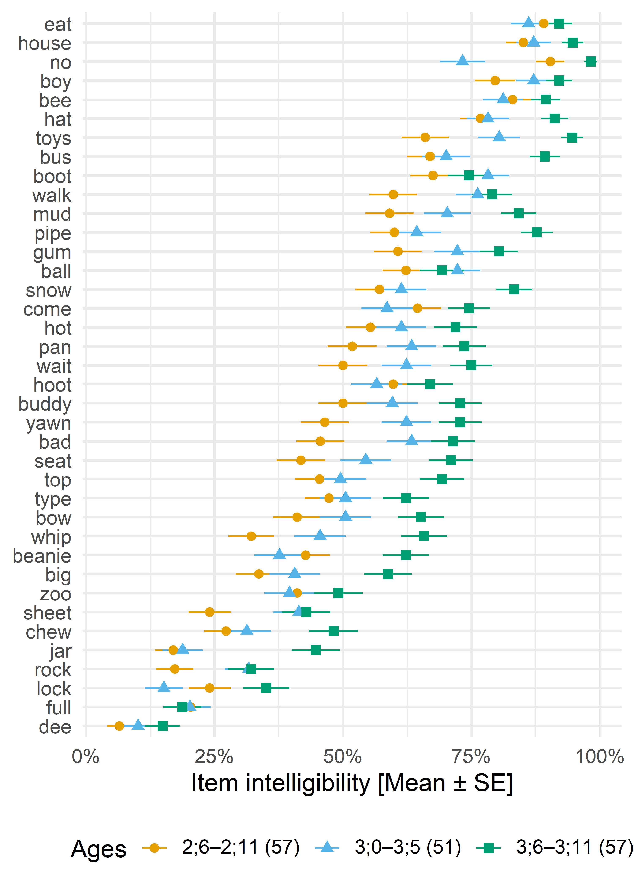
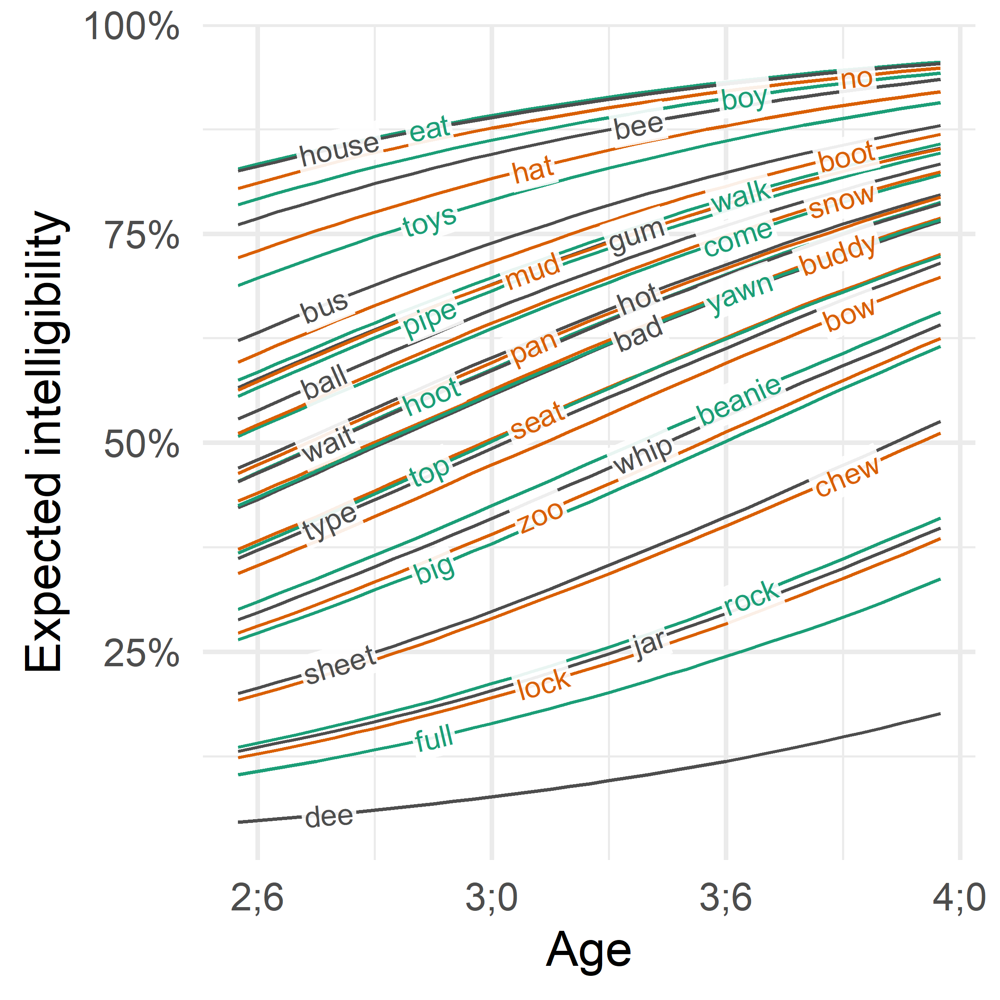

## Submission details

### Abstract

Speech perception is a probabilistic process, integrating bottom-up and
top-down sources of information, and the frequency or structure of a
word can predict how well it is perceived. Therefore, instead of asking
how intelligible speakers are, it is also important to ask how
intelligible individual words are. For this study, we measured the
intelligibility of 165 children between 30 and 47 months in age on 38
different words and asked how words varied in intelligibility and
whether word-level characteristics (frequency, phonotactic probability,
motor complexity) predicted intelligibility. An item-response analysis
showed that there was considerable variation in individual words with a
reliable effect of frequency such that higher frequency words were more
intelligible. 

### Disclosure

Tristan Mahr worked on this project while employed by the UW-Madison
Waisman Center. He has no relevant nonfinancial relationships to
disclose.

Katherine Hustad received a research grant from the NIH to collect these
data. She has no relevant nonfinancial relationships to disclose.            

### Objective

The learner will be able to list the word-level features that predict
intelligibility.            


## Rationale

Intelligibility measures how well a listener is able to recover a
speaker's intended message from a speech signal. Research commonly
examines predictors of intelligibility by looking at speaker
characteristics or acoustic features. But speech perception is
probabilistic, and the frequency or structure of a word can predict how
it is perceived [@vitevitch2016]. In other words, instead of asking
how intelligible speakers are, it is also important to ask how
intelligible individual words are. For this study, we measured the
intelligibility of young children and asked how words varied in
intelligibility and whether word-level characteristics (frequency,
phonotactic probability, motor complexity) predicted intelligibility.


## Methods

**Participants**. Participants included 165 children
(72 boys, 93 girls) between 30 and
47 months in age. Children were evenly distributed across the
overall age range: 57 between 30--35 months,
51 between 36--41 months, 57 between 42--47
months. Children had no history of speech or language concerns and
scored within normal limits on a speech articulation assessment.

**Task**. Speech samples were collected in a structured repetition task
based on the TOCS+ [@hodgeTOCS]. Prompts included 40 single words; 2
words were reserved for practice trials, so we analyzed the 38 test
items. Unfamiliar listeners transcribed the children’s productions; they
were played samples and instructed to type the words the child said.
Every child had transcriptions by two listeners; each listener only
heard productions from one child. A production was intelligible if a
listener correctly transcribed the word (or a homophone).

**Analysis**. We performed a Bayesian item-response analysis
[@burknerBayesianItemResponse2019]. This mixed-effects logistic
regression model estimates the expected intelligibility of an average
item on an average participant (overall intercept), each participant's
ability (by-child intercept) and each item's difficulty (by-item
intercept). We included covariates to examine whether age and item-level
features predicted intelligibility. These features included frequency of
the word in speech, phonotactic probability, and motor complexity.
Frequency counts were based on the SUBTLEX-US database
[@subtlexus2009]; we used frequency per million words
(log10-transformed). Phonotactic probability measures were computed
using the IPhOD database [@vadenIrvinePhonotacticOnline], using each
word's average biphone probability (log10-transformed). We computed each
word's total motor complexity score using the scale by @complexity2018
based on @kent1992. This systems assigns a score to each syllable part
(onset, nucleus, coda) based on its articulatory motor demands, ranging
from 1 (/ə, ɑ/) to 8 (cluster of 3 consonants). Table 1 reports the
observed intelligibility averages and lexical characteristics for each
item.


## Results

Figure 1 shows the posterior predicted intelligibility of each item for
a new, unobserved 3-year-old child. There were reliable item-level
differences, such that some words had a higher average intelligibility
than others. Of the three word-level features, only frequency had a
clear effect on average intelligibility (Figure 2). For an average item
on an average 36-month-old child with average frequency (51
per million words), phonotactic probability (.0011), and
complexity (9.87), the expected intelligibility was
56%, 95% interval [47, 65]. From this reference, a 10x increase
in frequency predicted an increase in average intelligibility of
10 percentage points, 95% interval [0, 18]. For
phonotactic probability, both positive and negative effects were equally
plausible, odds ratio 95% interval [0.37,
1.53]. For a 1-point increase in motor complexity, the
median odds ratio was 0.91, and the 95% interval was
[0.78, 1.07]. The sign of the effect is
likely negative (complexity penalty), but it is also plausible the
effect is too small to be meaningful. Finally, there was a clear effect
of age: A 6-month increase (from 36 to 42 months) predicted a
corresponding increase in intelligibility of 12 percentage
points, 95% interval [8, 15].


## Discussion

Young children's intelligibility varied greatly at the word level.
Higher frequency words tended to be more intelligible than lower
frequency words, and it was unclear whether the word's motor complexity
affected intelligibility. The speakers in this study were typically
developing, so further work is needed to see whether listeners rely more on
word-level features when presented with disordered speech. It is
plausible that listeners will rely more on top-down knowledge from
lexical statistics when hearing dysarthric children.


Table: *Table 1.* Item-level intelligibility results and measures. 

|Item   | Intelligibility [95% CI]| Freq. per million [Rank]| Mean biphone probability [Rank]| Motor complexity|
|:------|------------------------:|------------------------:|-------------------------------:|----------------:|
|eat    |           89.1% [85, 92]|               251.9 [ 8]|                     .00168 [13]|                7|
|house  |           89.1% [85, 92]|               514.0 [ 7]|                     .00035 [32]|               12|
|no     |           88.0% [84, 91]|              5971.5 [ 1]|                     .00089 [26]|                5|
|boy    |           86.9% [82, 90]|               529.8 [ 6]|                     .00013 [36]|                7|
|bee    |           84.7% [80, 88]|                10.4 [32]|                     .00097 [24]|                6|
|hat    |           82.5% [78, 86]|                64.2 [18]|                     .00155 [16]|               12|
|toys   |           80.3% [76, 85]|                13.2 [27]|                     .00009 [38]|               14|
|bus    |           75.9% [71, 80]|                74.2 [17]|                     .00685 [ 2]|               11|
|boot   |           73.7% [68, 78]|                11.1 [31]|                     .00093 [25]|               11|
|gum    |           71.5% [66, 76]|                13.4 [26]|                     .00427 [ 5]|                8|
|mud    |           71.5% [66, 76]|                14.8 [24]|                     .00540 [ 3]|                8|
|pipe   |           71.5% [66, 76]|                19.4 [23]|                     .00054 [30]|                9|
|walk   |           71.5% [66, 76]|               215.9 [ 9]|                     .00134 [18]|                8|
|ball   |           68.2% [63, 73]|               105.0 [13]|                     .00099 [23]|               12|
|snow   |           67.1% [62, 72]|                31.4 [21]|                     .00077 [29]|               10|
|come   |           66.0% [61, 71]|              3141.0 [ 2]|                     .00739 [ 1]|                8|
|hot    |           62.7% [58, 68]|               189.8 [10]|                     .00103 [22]|                9|
|pan    |           62.7% [58, 68]|                12.3 [29]|                     .00434 [ 4]|               10|
|wait   |           62.7% [57, 68]|               830.3 [ 3]|                     .00365 [ 6]|               12|
|hoot   |           61.6% [56, 66]|                 2.6 [36]|                     .00085 [27]|               10|
|buddy  |           60.5% [56, 66]|               102.9 [14]|                     .00360 [ 7]|               11|
|yawn   |           60.5% [55, 66]|                 1.0 [38]|                     .00053 [31]|               10|
|bad    |           59.4% [55, 65]|               545.2 [ 5]|                     .00131 [19]|               12|
|seat   |           56.1% [51, 61]|                78.8 [16]|                     .00208 [11]|               13|
|top    |           55.0% [50, 60]|               133.4 [12]|                     .00122 [20]|                9|
|type   |           53.9% [48, 59]|                60.6 [19]|                     .00083 [28]|               11|
|bow    |           52.8% [47, 58]|                20.3 [22]|                     .00023 [35]|                7|
|beanie |           48.4% [43, 53]|                 1.5 [37]|                     .00162 [15]|               11|
|whip   |           48.4% [43, 53]|                13.2 [28]|                     .00228 [ 9]|               10|
|big    |           45.1% [39, 50]|               682.8 [ 4]|                     .00167 [14]|               12|
|zoo    |           42.9% [38, 49]|                13.6 [25]|                     .00013 [37]|                8|
|sheet  |           36.3% [31, 41]|                11.6 [30]|                     .00110 [21]|               13|
|chew   |           35.2% [31, 41]|                 9.1 [33]|                     .00035 [33]|                8|
|jar    |           27.5% [23, 32]|                 8.3 [34]|                     .00270 [ 8]|               12|
|rock   |           26.4% [22, 32]|                86.2 [15]|                     .00175 [12]|               10|
|lock   |           25.3% [21, 30]|                56.6 [20]|                     .00147 [17]|               10|
|full   |           19.8% [16, 24]|               166.9 [11]|                     .00026 [34]|               13|
|dee    |            11.0% [8, 14]|                 6.6 [35]|                     .00223 [10]|                6|

## Plots (with code for sharing)

### Item means plot


```r
# This helps us position labels to nearest xth
new_quantile_nudger <- function(
  quantile,
  nudge = .02,
  round_to = .01,
  round_with = floor
) {
  function(xs) {
    plyr::round_any(
      quantile(xs, quantile) + nudge,
      accuracy = round_to,
      f = round_with
    )
  }
}

new_data_draws_item <- data %>% 
  distinct(prompt, age_years_3 = 0, zipf_freq3, log10_biphone3, complexity10) %>% 
  mutate(child = "fake") 

draws_item <- new_data_draws_item %>% 
  add_epred_draws(
    m_freq_prob_comp, 
    ndraws = 10000, 
    allow_new_levels = TRUE
  ) %>% 
  ungroup()

p1 <- ggplot(draws_item) +
  aes(x = .epred, y = fct_reorder(prompt, .epred)) +
  ggdist::stat_interval(
    .width = c(.95, .8, .5, 0)
  ) +
  ggstance::stat_summaryh(
    aes(x = .epred, y = prompt, label = prompt), 
    geom = "text",
    fun.x = new_quantile_nudger(.025, -.01, .025),
    size = 3.5,    
    vjust = .4,
    hjust = 1
  ) + 
  ggstance::stat_summaryh(
    fun.x = median, 
    geom = "point", 
    size = 2, 
    color = "black", 
    show.legend = TRUE
  ) +
  scale_color_manual(
    labels = function(xs) {
      levels <- c(.95, .8, .5, 0)
      labels <- c("95%", "80%", "50%", "median")
      factor(xs, levels, labels)
    },
    values = c(
      "0.95" = "#FADDC3", 
      "0.8" = "#F6A173", 
      "0.5" = "#EA4C3B", 
      "0" = "black"
      # "median" = "black"
    )
  ) +
  scale_x_continuous(
    "Estimated intelligibility for a new 3-year-old participant", 
    labels = scales::percent_format(5), 
    sec.axis = dup_axis(name = NULL)
  ) +
  coord_cartesian(clip = "off") +
  guides(
    color = guide_legend(
      title = "Posterior intervals",
      # Customize appearance of four boxes in legend
      override.aes = list(
        # Draw lines in first three, no line in last.
        linetype = c(rep(1, 3), 0),
        #  Draw the point in last one.
        shape = c(rep(NA, 3), 16)
      )
    )
  ) +
  theme_minimal() +
  theme(
    axis.title = element_text(hjust = 1),
    axis.text.y = element_blank(), 
    axis.title.y = element_blank(),
    axis.ticks.y = element_blank(),
    panel.grid.major.y = element_blank(),
    legend.position = "bottom",
    legend.justification = "right",
    legend.title = element_text(size = rel(.8)),
    legend.text = element_text(size = rel(.8)),
    legend.key = element_rect(fill = NA, color = NA),
    legend.box.spacing = unit(0, "pt"),
    legend.background = element_rect(fill = NA, color = NA)
  ) + 
  labs(
    title = "Some words are more difficult than others"
  )

p1
```


### Frequency plot


```r
data2 <- data %>% 
  mutate(
    age_bin = NA,
    age_bin = ifelse(age %in% c(30:35), "30-35", age_bin),
    age_bin = ifelse(age %in% c(36:41), "36-41", age_bin),
    age_bin = ifelse(age %in% c(42:47), "42-47", age_bin),
    age2 = NA,
    age2 = ifelse(age %in% c(30:35), 32.5, age2),
    age2 = ifelse(age %in% c(36:41), 38.5, age2),
    age2 = ifelse(age %in% c(42:47), 44.5, age2)
  ) %>% 
  group_by(age_bin) %>% 
  mutate(
    age_years_3 = (age2 - 36) / 12
  )

fitted_freq_prompt <- data %>% 
  tidyr::expand(
    age_years_3 = 0,
    log10_biphone3 = mean(log10_biphone3),
    complexity10 = mean(complexity10),
    zipf_freq3 = seq(-.1, 3.8, length.out = 100)
  ) %>% 
  mutate(freq_per_million = 10 ^ zipf_freq3) %>% 
  add_epred_draws(
    m_freq_prob_comp, 
    ndraws = 10000,
    re_formula = NA,
    allow_new_levels = TRUE
  ) 

freq_prompt_intervals <- fitted_freq_prompt %>% 
  median_qi(.epred, .width = c(.95, .8, .5)) %>% 
  mutate(
    .width = scales::percent(.width, accuracy = 1)
  ) 

widths <- c("95%", "80%", "50%", "median")
col_purple_median <- colorspace::sequential_hcl(palette = "Sunset", n = 1)
col_fills <- colorspace::sequential_hcl(
  3, 
  palette = "OrYel", 
  alpha = .6, 
  rev = TRUE
)

library(ggrepel)

p2b <- ggplot(freq_prompt_intervals) +
  aes(x = freq_per_million, y = .epred) + 
  geom_lineribbon(
    aes(
      fill = .width, 
      color = .point, 
      ymin = .lower, 
      ymax = .upper, 
      group = age_years_3
    ) 
  ) +
    stat_summary(
    aes(
      x = word_freq_per_million, 
      group = prompt, 
      y = m_word_a 
    ),
    data = data,
    geom = "point",
  ) +
  stat_summary(
    aes(
      x = word_freq_per_million, 
      group = prompt, 
      y = m_word_a, 
      label = prompt
    ),
    data = data,
    geom = "text_repel",
    min.segment.length = 0
  ) +
  scale_x_log10() +
  scale_y_continuous(
    labels = scales::percent_format(5), 
    breaks = c(0, .25, .5, .75, 1)
  ) +
  expand_limits(y = c(0, 1)) +
  scale_fill_manual(
    aesthetics = c("fill", "colour"),
    breaks = c("95%", "80%", "50%", "median"),
    values = c(col_fills, col_purple_median)
  ) +
  guides(
    fill = guide_legend(
      title = "Posterior intervals",
      override.aes = list(
        fill = c("#ECE0BA", "#F0B778", "#EF746E", NA),
        color = c(NA, NA, NA, col_purple_median),
        linetype = c(rep(0, 3), 1)
      )
    ),
    color = "none"
  ) + 
  theme_minimal(base_size = 14) +
  theme(
    panel.grid.minor.x = element_blank(),
    legend.position = "bottom",
    legend.justification = "right",
    legend.title = element_text(size = rel(.8)),
    legend.text = element_text(size = rel(.8)),
    legend.key = element_rect(fill = NA, color = NA),
    legend.box.spacing = unit(0, "pt"),
    legend.background = element_rect(fill = NA, color = NA)
  ) + 
  labs(
    x = "Frequency per million words", 
    y = "Average intelligibility"
  )
p2b
```


(Note to self: The points are the whole dataset (all ages) but the
frequency effect plotted is for a 36-month-old. Kind of a mismatch there)


## Extras (from the poster)


```r
m_baseline <- targets::tar_read("model_baseline_age_slope")
summary(m_baseline, priors = TRUE)
#>  Family: bernoulli 
#>   Links: mu = logit 
#> Formula: m_word_a ~ 1 + age_years_3 + (age_years_3 | prompt) + (1 | child) 
#>    Data: data (Number of observations: 12334) 
#>   Draws: 4 chains, each with iter = 2500; warmup = 0; thin = 1;
#>          total post-warmup draws = 10000
#> 
#> Priors: 
#> b ~ normal(0, 1)
#> Intercept ~ normal(0, 2)
#> L ~ lkj_corr_cholesky(2)
#> sd ~ normal(0, 1)
#> 
#> Group-Level Effects: 
#> ~child (Number of levels: 165) 
#>               Estimate Est.Error l-95% CI u-95% CI Rhat Bulk_ESS Tail_ESS
#> sd(Intercept)     0.68      0.05     0.59     0.77 1.00     2578     4457
#> 
#> ~prompt (Number of levels: 38) 
#>                            Estimate Est.Error l-95% CI u-95% CI Rhat Bulk_ESS
#> sd(Intercept)                  1.12      0.14     0.89     1.42 1.00     1440
#> sd(age_years_3)                0.29      0.08     0.12     0.46 1.00     3392
#> cor(Intercept,age_years_3)     0.08      0.25    -0.40     0.56 1.00     7696
#>                            Tail_ESS
#> sd(Intercept)                  2731
#> sd(age_years_3)                3246
#> cor(Intercept,age_years_3)     5617
#> 
#> Population-Level Effects: 
#>             Estimate Est.Error l-95% CI u-95% CI Rhat Bulk_ESS Tail_ESS
#> Intercept       0.26      0.20    -0.12     0.65 1.01      588     1349
#> age_years_3     0.99      0.14     0.72     1.27 1.00     2119     3347
#> 
#> Draws were sampled using sample(hmc). For each parameter, Bulk_ESS
#> and Tail_ESS are effective sample size measures, and Rhat is the potential
#> scale reduction factor on split chains (at convergence, Rhat = 1).
```

### Plot of observed age x item


```r
data <- data %>% 
  group_by(age %/% 6) %>% 
  mutate(
    age_bin = (age %/% 6) * 6,
    age_bin = printy::skel_range(
      wisclabmisc::format_year_month_age(age_bin),
      wisclabmisc::format_year_month_age(age_bin + 5),
    ),
    age_bin = glue::glue("{age_bin} ({n_distinct(child)})")
  ) %>% 
  ungroup() %>% 
  mutate(
    prompt2 = forcats::fct_reorder(prompt, m_word_a, .fun = mean)
  ) 

# For a horizontal legend key
draw_key_pointrangeh <- function(data, params, size) {
  `%||%` <- rlang::`%||%`
  grid::grobTree(
    ggplot2::draw_key_path(data, params, size), 
    ggplot2::draw_key_point(
      transform(data, size = (data$size %||% 1.5) * 4), 
      params
    )
  )
}

p0 <- ggplot(data) + 
  aes(x = m_word_a, y = prompt2, shape = age_bin) + 
  stat_summary(aes(color = age_bin), key_glyph = draw_key_pointrangeh) +
  ggokabeito::scale_color_okabe_ito() +
  scale_x_continuous(
    "Item intelligibility [Mean ± SE]",
    labels = scales::percent_format(),
  ) +
  theme_minimal(base_size = 14) +
  theme(
    legend.text = ggtext::element_markdown(), 
    legend.position = "bottom", 
  ) +
  labs(color = "Ages", shape = "Ages", y = NULL) 

p0
```

<!-- -->

### Variance comparison plot


```r
library(tidyverse)
library(brms)
library(tidybayes)
library(ggdist)
library(dplyr)
library(ggtext)

data_model <- targets::tar_read("data_model")

data_model <- data_model %>% 
  filter(prompt == sentence) %>% 
  group_by(age %/% 6) %>% 
  mutate(
    age_bin = (age %/% 6) * 6,
    age_bin = printy::skel_range(
      wisclabmisc::format_year_month_age(age_bin),
      wisclabmisc::format_year_month_age(age_bin + 5),
    ),
    age_bin = glue::glue("{age_bin} ({n_distinct(child)})")
  ) %>% 
  ungroup() %>% 
  mutate(
    prompt2 = forcats::fct_reorder(prompt, m_word_a, .fun = mean)
  ) 

model_baseline <- targets::tar_read(model_baseline_age_slope)


new_data <- data_model %>% 
  tidyr::expand(
    child = "fake child",
    prompt = "fake prompt",
    age_years_3 = 0
  )

epred_child <- new_data %>% 
  add_epred_draws(
    model_baseline,
    allow_new_levels = TRUE,
    re_formula = ~ (1 | child)
  )
epred_item <- new_data %>% 
  add_epred_draws(
    model_baseline,
    allow_new_levels = TRUE,
    re_formula = ~ (1 | prompt)
  )

p1 <- ggplot() +
  stat_interval(
    aes(x = .epred, y = "Model:\naverage item\nnew child"),
    data = epred_child
  ) +
  stat_interval(
    aes(x = .epred, y = "Model:\naverage child\nnew item"),
    data = epred_item
  ) + 
  geom_boxplot(
    aes(x = intel, y = "Observed: item\nintelligibilities", group = age_bin),
    data = data_model %>% 
      group_by(item, age_bin) %>% 
      summarise(intel = mean(m_word_a)),
    position = position_dodge2(width = .5)
  ) +
  geom_boxplot(
    aes(x = intel, y = "Observed: child\nintelligibilities", group = age_bin),
    data = data_model %>% 
      group_by(child, age_bin) %>% 
      summarise(intel = mean(m_word_a)),
    position = position_dodge2()
  ) +
  stat_boxplot(
    aes(x = 1, y = "Observed: child\nintelligibilities", group = age_bin, label = age_bin),
    data = data_model %>% 
      group_by(age_bin, child) %>% 
      summarise(intel = mean(m_word_a)),
    hjust = 0,
    geom = "richtext",
    label.colour = NA,
    fill = scales::alpha("white", .8),
    size = 4, 
    position = position_dodge2(width = .85)
  ) +
  stat_boxplot(
    aes(x = 1, y = "Observed: item\nintelligibilities", group = age_bin, label = age_bin),
    data = data_model %>% 
      group_by(age_bin, item) %>% 
      summarise(intel = mean(m_word_a)),
    hjust = 0,
    geom = "richtext",
    label.colour = NA,
    fill = scales::alpha("white", .8),
    size = 4, 
    position = position_dodge2(width = .85)
  ) +
  colorspace::scale_color_discrete_sequential("Peach") +
  scale_x_continuous(
    limits = c(0, 1.3), 
    labels = scales::label_percent(),
    breaks = 0:5 / 5
  ) +
  labs(
    x = "Expected intelligibility", 
    y = NULL, 
    color = "Posterior\nintervals"
  ) +
  coord_cartesian(clip = "off") +
  theme_minimal(base_size = 14) + 
  theme(
    legend.position = c(.999, .45), 
    legend.text.align = 1,
    legend.title.align = 1,
    legend.background = element_rect(fill = scales::alpha("white", .8), color = NA),
    legend.justification = c(1, 1),
    panel.grid.major.y = element_blank()
  ) 
p1
```


### Item slopes plot


```r
item_slopes <- targets::tar_read("epred_item_slopes")

# justs for "justifications" (horizontal location)
justs <- item_slopes %>% 
  filter(age == 30, .width == .5) %>% 
  arrange(.epred) %>% 
  mutate(
    hjust = rep(ppoints(6), 10)[1:38]
  ) %>% 
  select(prompt, hjust)

p2 <- ggplot(item_slopes %>% left_join(justs)) +
  aes(x = age) + 
  geomtextpath::geom_labelline(
    aes(
      label = prompt, 
      y = .epred, 
      group = prompt,
      color = factor(hjust),
      hjust = hjust,
      boxcolour = NA,
    ),
    alpha = NA,
    label.padding = unit(.05, "lines"),
    boxlinewidth = 0, 
    size = 3,
    vjust = .5,
    label.r = unit(0, "lines"),
    fill = scales::alpha("#FFFFFF", .9)
  ) + 
  geomtextpath::scale_hjust_identity(guide = "none") + 
  theme_minimal(base_size = 14) +
  guides(color = "none") +
  scale_x_continuous(
    "Age", 
    breaks = c(30, 36, 42, 48),
    labels = wisclabmisc::format_year_month_age
  ) +
  scale_y_continuous(
    "Expected intelligibility", 
    labels = scales::percent_format()
  ) +
  guides(color = "none") +
  theme_minimal(base_size = 14) +
  scale_color_manual(
    values = c("grey30", palette.colors(n = 2, "Dark 2")) |> rep(2)
  )
p2
```




## References
